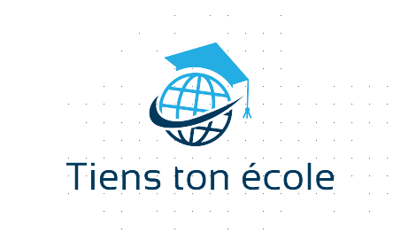

 

    

  <h3 align="center">README Projet Tiens ton école</h3>

<!-- Sommaire -->

  
Sommaire

  <ol>
    <li>
      A propos du projet
      <ul>
          <li>Logiciel utilisé</li>
      </ul>
    </li>
    <li>
        Roadmap
      <ul>
        <li>Pour commencer</li>
        <li>Les étapes</li>
      </ul>
    </li>
    <li>Les Actions</li>
    <li>Contribution</li>
  </ol>

<!-- A propos du projet -->
## A propos du projet
Nous avons créer un site web permettant de nous aider à choisir une orientation scolaire.

### Logiciel utilisé 

<!--Road Map -->
## Road Map

### Pour commencer

### Les étapes

Dates:

<!--Les Actions -->
## Les Actions 

<!--Contribution -->
## Contribution

Bastien Marbaud de Brenignan T-10

Antoine Nicolas-Lutfalla T-10

Tristan Koukerdjinian--Massoulier T-10
